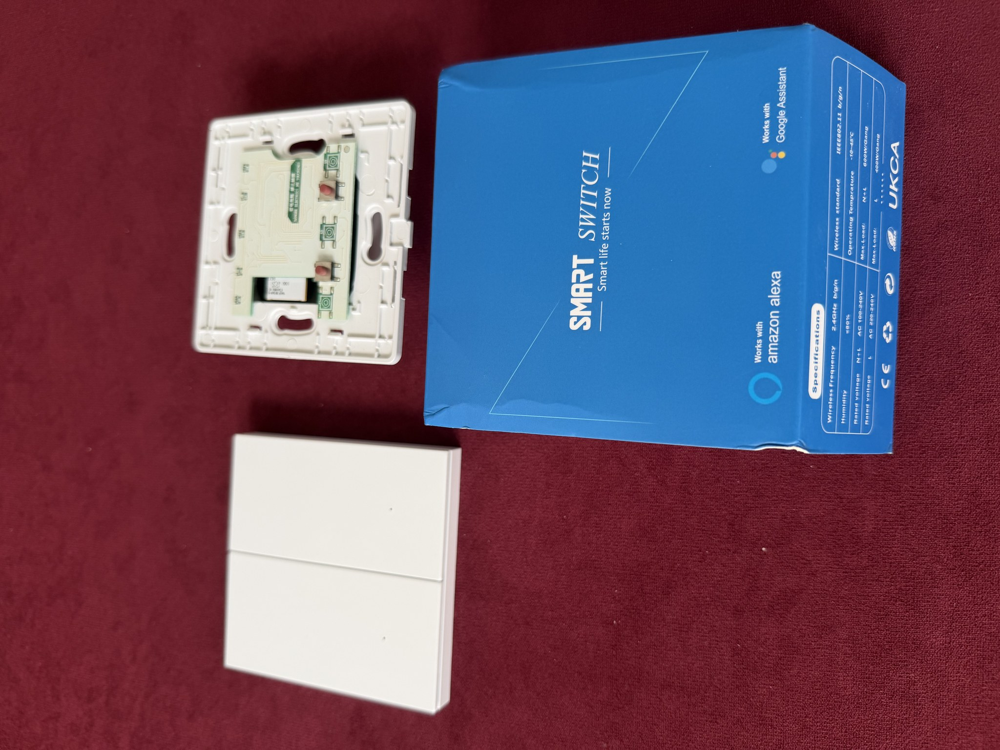
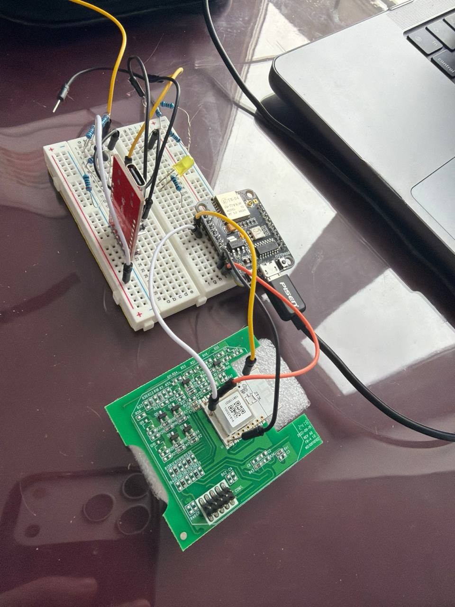

# wall switch

Экспериментальная прошивка и инструменты для исследования двухклавишного
настенного выключателя Tuya ZT3L на Telink TLSR825x/TLSR8258. Цель проекта —
понять, можно ли заменить заводскую логику и добиться предсказуемой работы
выключателя через Zigbee-координатор Дома с Алисой.

Проект предназначен для лабораторных экспериментов, а не для установки без
проверки на конкретной плате. Подтверждены сборка, host-тесты, запись через
TB-04 UART2SWire и запуск прошивки на стенде. Успешное создание карточки
устройства в Алисе ещё не считается гарантированным.

## Зачем нужен проект

У выключателя есть физические клавиши, реле и индикаторы, но их поведение
определяется прошивкой и Zigbee-моделью устройства. Проект исследует замену
заводской прошивки на открытую тестовую логику, чтобы проверить:

- обнаружение и сопряжение выключателя с Алисой;
- управление двумя каналами и передачу их состояния;
- поведение индикаторов при включении, выключении и поиске устройства;
- стандартные Zigbee-атрибуты и команды, которые нужны координатору.

Иными словами, это попытка сделать конкретный аппаратный выключатель понятным
для экосистемы Яндекса без предположений, что любая модель Tuya совместима с
этой прошивкой.

## Какой аппарат используется

| Компонент | Что это | Роль в проекте | Совместимость |
| --- | --- | --- | --- |
| Настенный выключатель | Двухклавишный Tuya Smart Switch на плате с модулем ZT3L | Целевое устройство, на котором запускается прошивка | Только платы с тем же модулем, распиновкой и подтверждённым чипом |
| Контроллер выключателя | Telink TLSR825x; в базе устройства встречается TLSR8258 | Радио, Zigbee-стек, клавиши, реле и светодиоды | Не переносить образ на ESP32, EFR32 или другой Tuya-модуль |
| Программатор | TB-04 с UART2SWire/SWire | Чтение резервной копии и запись прошивки по низковольтному интерфейсу | Нужны правильные SWire/RESET/3,3 В подключения |
| Zigbee-координатор | Хаб Яндекса/Дом с Алисой | Поиск, сопряжение и управление устройством | Результат зависит от Zigbee-модели, прошивки и версии хаба |

Фото ниже показывают именно эту связку: сам выключатель и его плату, а также
лабораторный стенд с программатором и контроллером. Они не являются схемой
подключения к сети 230 В.

### Сам выключатель и заводской модуль



### Лабораторное подключение для прошивки и проверки



### Для каких устройств подходит

Прошивка предназначена прежде всего для исследованного варианта Tuya ZT3L с
Telink TLSR825x/TLSR8258 и соответствующей распиновкой. Название корпуса,
логотип или похожая фотография сами по себе не подтверждают совместимость:
перед записью нужно определить модуль, чип, объём flash, питание и точки SWire.

Другие Tuya-выключатели, платы на ESP32, Silicon Labs или другой версии Telink
считаются неподдерживаемыми, пока для них отдельно не проверены схема и образ.

## Состав

- `firmware/application/` — собственная логика приложения, Zigbee-дескрипторы и тесты;
- `firmware/upstream/` — зафиксированный upstream snapshot с отдельной лицензией;
- `scripts/` — подготовка сборки, статические проверки и host-тесты;
- `tools/tlsrpgm/` — исходники инструментов программирования и схемы подключения;
- `docs/` — архитектура, сборка, ограничения и процедура безопасного эксперимента.

Заводские дампы, сырые аппаратные логи, драйверы и бинарные загрузчики в
публичный snapshot намеренно не входят. Они могут содержать закрытый код
производителя, уникальные идентификаторы и калибровочные данные.

## Быстрый старт

Для host-проверок на macOS или Linux:

```sh
SANITIZE=undefined ./scripts/test_application.sh
```

Для TC32-сборки нужен Docker и подготовленный upstream SDK/toolchain. Полная
процедура описана в [сборке](docs/build-baseline.md) и
[диагностической прошивке](docs/diagnostic-firmware.md).

## Безопасность

Не подключайте устройство к сети 230 В во время прошивки и первичной проверки.
Используйте только изолированное питание 3,3 В, заранее проверяйте распиновку и
сохраняйте собственный резервный дамп устройства. Команды стирания всей flash в
публичную инструкцию не входят.

См. [публичный статус проекта](docs/public-status.md),
[инструкцию по прошивке](docs/public-flashing.md),
[лицензии сторонних компонентов](THIRD_PARTY_NOTICES.md) и
[правила участия](CONTRIBUTING.md).
